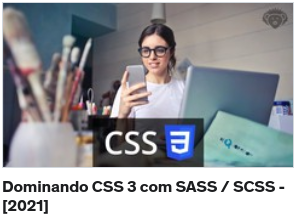

# Dominando CSS 3 com SASS / SCSS - [2021]

<h2>Sobre</h2>

<b>Deseja aprender Sites e aplicativos poderosos com layout profissional utilizando todos os recursos da linguagem de estilos CSS 3?Que tal aprender a criar projetos profissionais e dominar as mais de 100 propriedades CSS 3, funções dessa linguagem que junto com HTML5 e JavaScript formam os pilares da web? Ou será que chegou a hora de elevar o seu conhecimento em CSS3 e Sass para além de hover, font-family, background?

Qualquer que seja a sua motivação você está no lugar certo.</b>

Este é o Curso Completo de CSS3 com Sass e mais de 110 aulas.

Primeiro você aprenderá sobre CSS desde o básico da estrutura, propriedades até recursos avançados, depois como utilizá-la na prática construindo projetos reais passo a passo com dois especialistas em CSS que possuem mais de 15 anos de desenvolvimento Web e CSS3.

Neste curso cobriremos mais de 13 horas de conteúdo em vídeo dos seguintes tópicos:

Ao final deste curso você estará apto a criar aplicações profissionais utilizando CSS e Sass, levando suas aplicações web, sejam sites ou web apps a um nível profissional. Entenderá e se tornará um especialista Front-End em criação, assim como o mercado tem procurado hoje em dia.

O acesso ao curso é vitalício e no final você ainda recebe o Certificado Digital de Conclusão com a Carga Horária do curso!

Te aguardo no curso!

## Para quem é este curso:

- Este curso de CSS destina-se a todos os desenvolvedores web, seja Front-End ou Back-End, a parte inicial será útil para quem está no começo, depois avançamos o conteúdo para profissionais.
- Estudantes de Cursos voltados a Tecnologia da Informação ou Interessados em ingressar na área de Tecnologia da Informação, e mais especificamente no mercado de Desenvolvimento Web.

## Há algum requisito ou pré-requisito para o curso?

- Você já deve estar familiarizado com a Internet.
- Ter realizado o nosso Curso de HTML 5 COMPLETO e com Projetos Práticos para WEB, ou possuir conhecimentos em HTML5.
- Aprenda a utilizar os recursos da CSS3, desde a estrutura da linguagem, todas as propriedades da CSS, isso mesmo mais de 100 propriedades.
- Você não precisa ter experiência prévia em CSS, afinal, vai aprender desde o básico, e iremos até o avançado.

<a href="https://www.udemy.com/course/curso-css-3-com-sass/">CURSO CSS</a>
 
 

 

